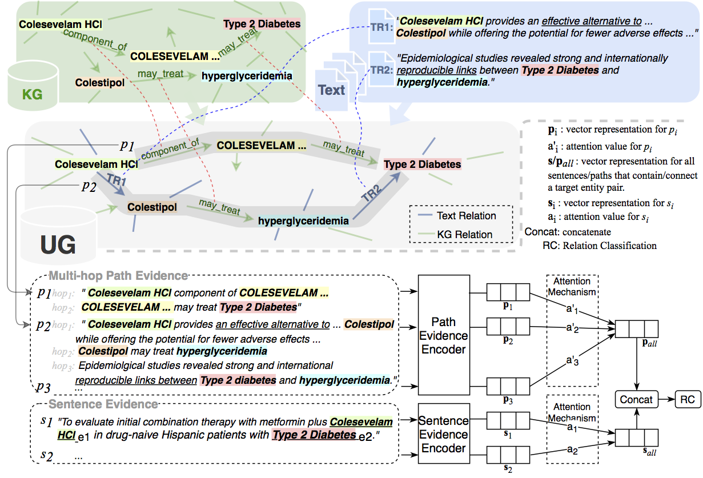

# UGDSRE
Codes and datasets for our paper "Two Training Strategies for Improving Relation Extraction over Universal Graph"
## Overview of our framework

## Dependencies
- python = 2.x
- tensorflow = 1.9.0
- numpy = 1.15.4
- sklearn = 0.19.1
## Data preprocessing
- We use NYT10 (Riedel et al., 2010) and Biomedical datasets for evaluation.
- The datasets with path evidences can be downloaded from here: NYT10 and Biomedical.
### NYT10 dataset
- Unzip the NYT10 dataset and allocate all the files under `origin_data_nyt10` folder, then run the following commands for preprocessing.
~~~
python initialize_nyt10_part1.py
python initialize_nyt10_part2.py
~~~
- Or you can download the preprocessed NYT10 dataset from here: part1; part2, and unzip them under `nyt10_part1` and `nyt10_part2` directory respectively.
### Biomedical dataset
- Unzip the Biomedical dataset and allocate all the files under `origin_data_biomedical` directory, then run the following commands for preprocessing. (Due to the large size of the dataset, it will takes about 2 hours to process the dataset.)
~~~
python initialize_biomedical_part1.py
python initialize_biomedical_part2.py
~~~
- Or you can download the preprocessed Biomedical dataset from here: part1; part2, and unzip them under `biomedical_part1` and `biomedical_part2` directory respectively.
## Evaluate pretrained model
- Download our pretrained model's parameters from NYT10 and Biomedical and put them under `ugdsre_nyt10/model_saved` and `ugdsre_biomedical/model_saved` respectively.
- Execute the following command on NYT10 dataset.
~~~
cd ugdsre_nyt10
CUDA_VISIBLE_DEVICES=0 python2 test_ug_proposed.py ranking_pretrain
~~~
- Execute the following command on Biomedical dataset.
~~~
cd ugdsre_biomedical
CUDA_VISIBLE_DEVICES=0 python test_ug_proposed.py ranking_pretrain
~~~
#### The results of the pretrained model
### Baseline model
- Download the pretrained parameters of baseline model ([Dai et al., 2019](http://jaslli.org/files/proceedings/03_paclic33_postconf.pdf)) from NYT10 and Biomedical and put them under `ugdsre_nyt10/model_saved` and `ugdsre_biomedical/model_saved` respectively, and test the model  via following command.
~~~
cd ugdsre_nyt10
CUDA_VISIBLE_DEVICES=0 python test_baseline.py sent_kg
~~~
~~~
cd ugdsre_biomedical
CUDA_VISIBLE_DEVICES=0 python test_baseline.py sent_kg
~~~
## Train our model
- For training UGDSRE on NYT10 dataset, run:
~~~
cd ugdsre_nyt10
python train_ug_proposed.py --gpu 0 --pretrain_epoch 50 --ranking_epoch 50
~~~
- For traing UGDSRE on Biomedical dataset, run:
~~~
cd ugdsre_biomedical
python train_ug_proposed.py --gpu 0 --pretrain_epoch 50 --ranking_epoch 100
~~~
- Finally, run `CUDA_VISIBLE_DEVICES=0 python2 test_ug.py --max_epoch [50 or 100]` for testing.
## Acknowledgements
Special thanks for the [codes](https://github.com/thunlp/JointNRE) of the paper "Neural Knowledge Acquisition via Mutual Attention between Knowledge Graph and Text" (Han et al., 2018)
